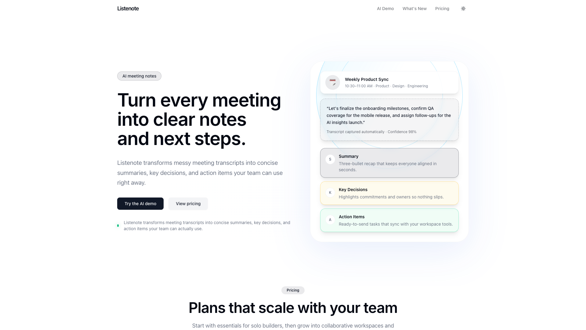
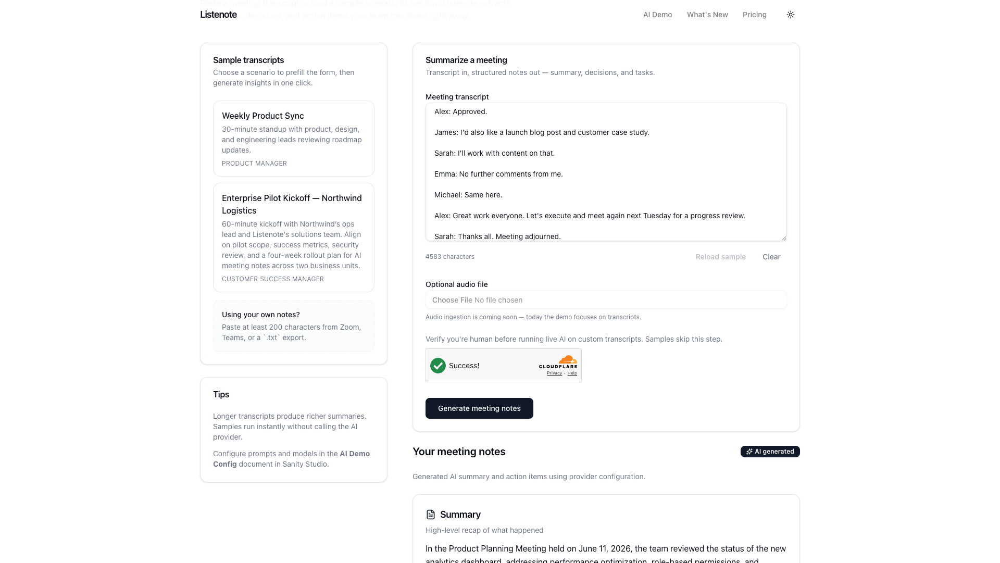
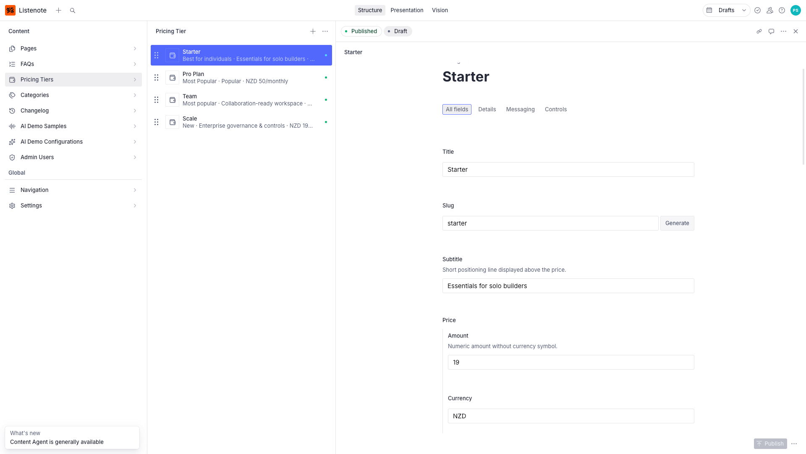

# Listenote — AI Meeting Notes Demo

**Listenote** turns meeting transcripts into clear summaries, decisions, and action items. A portfolio demo combining a Sanity-driven marketing site, an interactive AI workflow, and a CMS-powered changelog.

[](https://nextjs.org/)
[](https://www.sanity.io/)
[](https://reactjs.org/)
[](https://www.typescriptlang.org/)
[](https://tailwindcss.com/)
[](https://ui.shadcn.com/)

**Live demo:** [listenote.vercel.app](https://listenote.vercel.app/)

## Overview

| | |
|---|---|
| **Stack** | Next.js 15 · TypeScript · Tailwind CSS · shadcn/ui · Sanity CMS · OpenAI · Vitest · Vercel |
| **Tests** | 24 passing (Vitest) |
| **Build** | Production-ready (`pnpm build`) |

## Screenshots

### Homepage



### AI demo



### Sanity Studio



## At a glance

| Route | What it demonstrates |
|---|---|
| `/` | CMS-driven marketing homepage with animated hero, pricing tiers, and CTAs |
| `/ai-demo` | Server-action AI workflow — paste a transcript, get structured output |
| `/what-new` | Sanity-powered changelog with list + detail routes |
| `/studio` | Sanity Studio with visual editing and typed content blocks |

## Case study

### The problem

Most "AI SaaS" portfolio pieces stop at a static landing page. I wanted a demo that proves I can ship what real clients pay for: a marketing site their team can edit without a developer, plus a genuinely interactive product feature backed by server-side AI.

### What I built

- **CMS-driven marketing site** — Homepage, pricing, and CTAs are composed from typed Sanity blocks (`hero`, `pricing-row`, `cta`, etc.). Non-technical editors restructure pages in Studio with live visual editing — no redeploy required.
- **Interactive AI demo (`/ai-demo`)** — Users paste a transcript or load a sample. A Next.js server action calls an OpenAI adapter and returns structured summaries, decisions, and action items. Samples run offline; live calls degrade gracefully with clear error states.
- **Sanity-powered changelog (`/what-new`)** — Release entries with impact badges, audience targeting, and Portable Text bodies, including list/detail routes and empty states.
- **Production polish** — Accessible shadcn/ui components, `prefers-reduced-motion`-aware Framer Motion hero, SEO metadata, Open Graph image, sitemap, and PWA icons.

### Engineering highlights

- **End-to-end type safety** — GROQ queries generate TypeScript types (`sanity.types.ts`); blocks render through a discriminated-union `componentMap`.
- **Server-first architecture** — React Server Components by default; client components only where interactivity is required; ISR/revalidation on content lists.
- **Tested core logic** — Vitest coverage for the AI server action, OpenAI adapter, provider error handling, bot protection, and key UI blocks.
- **Resilient AI layer** — Provider abstraction, timeouts, heuristic fallbacks, and Cloudflare Turnstile bot protection keep the demo stable in production.

### Outcome

A single deployment serving a marketing site, an editable CMS, and a working AI feature — demonstrating ownership of a modern Next.js + headless-CMS product from schema to UI to deploy.

---

## Getting started

### Prerequisites

- Node.js 20+
- [pnpm](https://pnpm.io/) (recommended) or npm
- A Sanity project (or use the bundled seed data)

### Run locally

```bash
pnpm install
cp .env.example .env.local   # then fill in your values
pnpm dev
```

Open the app at [http://localhost:3000](http://localhost:3000) and Studio at [http://localhost:3000/studio](http://localhost:3000/studio).

### Import sample content

```bash
npx sanity dataset import listenote-seed.ndjson production --replace
```

Document types: `Page`, `Pricing Tier`, `Changelog Entry`, `AI Demo Sample`, `AI Demo Config`, `FAQ`, `Category`, `Admin User`.

### Configure the AI demo (optional)

Without an API key, the UI works with demo samples and lightweight heuristic summaries.

To connect a live provider:

```bash
OPENAI_API_KEY=sk-...
AI_DEMO_PROVIDER=openai
AI_DEMO_MODEL=gpt-4o-mini
AI_DEMO_MAX_TOKENS=1200
AI_DEMO_TEMPERATURE=0.7
```

Update the **AI Demo Config** document in Studio to tweak the system prompt, model, and temperature.

### Protect live AI from bots (production)

Custom transcripts call OpenAI and can incur cost if abused. **Sample transcripts never call OpenAI.**

For production, add [Cloudflare Turnstile](https://developers.cloudflare.com/turnstile/) (free):

```bash
NEXT_PUBLIC_TURNSTILE_SITE_KEY=...
TURNSTILE_SECRET_KEY=...
```

If Turnstile keys are missing in production (`NEXT_PUBLIC_SITE_ENV=production`), live AI on custom transcripts is disabled — samples still work.

### Deploy

1. Add your production URL to CORS origins in Sanity project settings.
2. Push to GitHub and deploy on [Vercel](https://vercel.com/new).
3. Copy environment variables from `.env.local` into deployment settings.

Invite collaborators via [Sanity Manage](https://www.sanity.io/manage).

---

## Extending the CMS

Page blocks live under `sanity/schemas/blocks/`. To add a new block:

1. Create the schema in `sanity/schemas/blocks/`
2. Register it in `sanity/schema.ts` and `sanity/schemas/documents/page.ts`
3. Add a GROQ query fragment in `sanity/queries/`
4. Add a React component in `components/blocks/`

Regenerate types after schema changes:

```bash
pnpm typegen
```

---

## Environment variables

| Variable | Description |
|---|---|
| `NEXT_PUBLIC_SITE_URL` | Site URL without trailing slash |
| `NEXT_PUBLIC_SITE_ENV` | Set to `development` on staging to block search indexing |
| `NEXT_PUBLIC_SANITY_API_VERSION` | Sanity API version (e.g. `2024-01-01`) |
| `NEXT_PUBLIC_SANITY_PROJECT_ID` | Sanity project ID |
| `NEXT_PUBLIC_SANITY_DATASET` | Dataset name (e.g. `production`) |
| `SANITY_API_READ_TOKEN` | Read token for fetching content in Next.js |
| `OPENAI_API_KEY` | OpenAI API key for live AI demo |
| `AI_DEMO_PROVIDER` | Provider adapter (`openai`) |
| `AI_DEMO_MODEL` | Model name (e.g. `gpt-4o-mini`) |
| `AI_DEMO_MAX_TOKENS` | Max tokens for AI responses |
| `AI_DEMO_TEMPERATURE` | Sampling temperature |
| `AI_DEMO_TIMEOUT_MS` | Provider timeout in ms (default `15000`) |
| `NEXT_PUBLIC_TURNSTILE_SITE_KEY` | Cloudflare Turnstile site key |
| `TURNSTILE_SECRET_KEY` | Cloudflare Turnstile secret key |

---

## Scripts

| Command | Description |
|---|---|
| `pnpm dev` | Start development server |
| `pnpm build` | Production build |
| `pnpm start` | Start production server |
| `pnpm lint` | Run ESLint |
| `pnpm test` | Run Vitest test suite |
| `pnpm typecheck` | TypeScript type check |
| `pnpm typegen` | Regenerate Sanity TypeGen types |

---

## License

See [LICENSE](LICENSE).